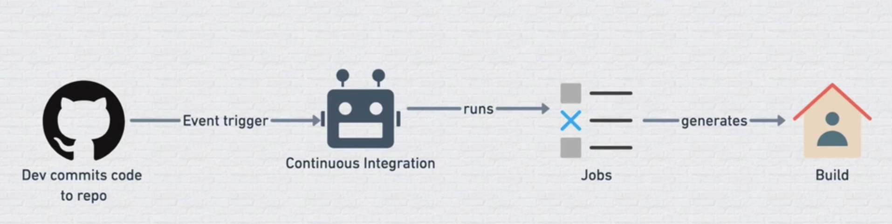

# Overview About Github Actions

## What is Github Action
GitHub Actions is a continuous integration and continuous delivery (CI/CD) platform that allows you to automate your build, test, and deployment pipeline. You can create workflows that build and test every pull request to your repository, or deploy merged pull requests to production.

GitHub Actions is an API that’s used to automate, customise, and execute software development workflows right in your GitHub repository. Developers and security professionals have found ways to use Actions to implement automation and CI/CD workflows in DevSecOps.

GitHub Actions goes beyond just DevOps and lets you run workflows when other events happen in your repository. For example, you can run a workflow to automatically add the appropriate labels whenever someone creates a new issue in your repository.

You can configure a GitHub Actions **workflow** to be triggered when an **event** occurs in your repository, such as a pull request being opened or an issue being created. Your workflow contains one or more **jobs** which can run in sequential order or in parallel. Each job will run inside its own virtual machine **runner**, or inside a container, and has one or more **steps** that either run a script that you define or run an **action**, which is a reusable extension that can simplify your workflow.

### CI(Continuous Integration)

Continuous Integration (CI) is a development practice where developers regularly merge their code changes into a shared repository, typically multiple times a day. These changes are automatically tested and validated, ensuring that the new code integrates well with the existing codebase

**USE CASES**
- Frequent Integration: Developers frequently merge code changes into a shared repository.
- Automated Builds: Each code change triggers an automated build process.
- Automated Testing: Tests run automatically after every integration to ensure code quality.
- Immediate Feedback: CI tools provide quick feedback on code issues or conflicts.
- Prevents Integration Issues: Frequent integration helps avoid "integration hell."
-  Version Control Integration: Works with tools like GitHub, GitLab, Bitbucket.
- CI Tools: Jenkins, Travis CI, CircleCI, GitHub Actions automate the CI process.
- Improves Collaboration: Helps teams work together efficiently by spotting bugs early.
- Reduces Risk: Ensures that code remains in a deployable state.
- Faster Release Cycle: Enables continuous deployment or faster, more reliable releases.

You have just learned the **basics of Docusaurus** and made some changes to the **initial template**.

Docusaurus has **much more to offer**!

<!-- Have **5 more minutes**? Take a look at **[versioning](../tutorial-extras/manage-docs-versions.md)** and **[i18n](../tutorial-extras/translate-your-site.md)**. -->

Anything **unclear** or **buggy** in this tutorial? [Please report it!](https://github.com/facebook/docusaurus/discussions/4610)

## What's next?

- Read the [official documentation](https://docusaurus.io/)
- Modify your site configuration with [`docusaurus.config.js`](https://docusaurus.io/docs/api/docusaurus-config)
- Add navbar and footer items with [`themeConfig`](https://docusaurus.io/docs/api/themes/configuration)
- Add a custom [Design and Layout](https://docusaurus.io/docs/styling-layout)
- Add a [search bar](https://docusaurus.io/docs/search)
- Find inspirations in the [Docusaurus showcase](https://docusaurus.io/showcase)
- Get involved in the [Docusaurus Community](https://docusaurus.io/community/support)
