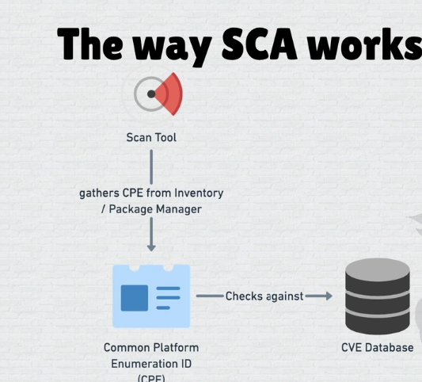
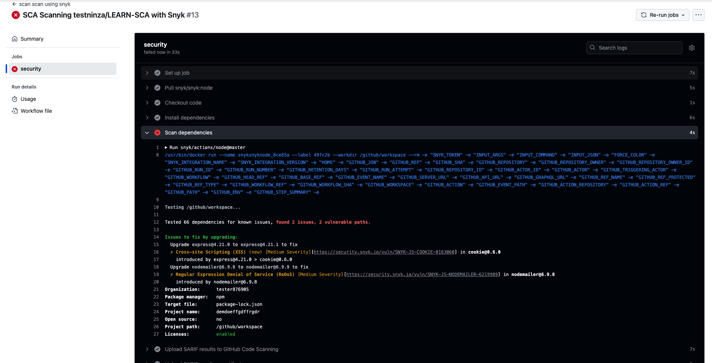

Whenever you read about devsecops . sca analysis is first step in securing Application devops pipeline.
So let's Read what is sca and why it needed , let's cover 

## What is SCA ?

When developers build code, they often rely on various libraries and dependencies that the application requires to function. Software Composition Analysis (SCA) is the process of analyzing these dependencies within the application’s codebase.

In a **DevOps pipeline,** the process starts when developers commit code into a Source Code Management (SCM) system. Pipeline actions are then triggered to create a build that includes all dependencies required by the application. To ensure security and compliance, dependencies are analyzed before building the code. This analysis checks for vulnerabilities, licensing issues, and outdated packages, ensuring that each dependency is secure and up-to-date


SCA scans for known vulnerabilities, licensing issues, and compliance risks in these third-party components. By identifying and addressing these issues early, SCA strengthens security and ensures safer, compliant software. It’s a foundational step in maintaining secure and reliable DevSecOps pipelines.

## Why SCA Required ?

Software Composition Analysis (SCA) is crucial because it manages security risks that come with using third-party and open-source dependencies, including identifying unknown dependencies that might inadvertently be introduced. Here’s why SCA is necessary:

- **Vulnerability Identification**: Detects known vulnerabilities within all dependencies, preventing potential exploits.
- **Unknown Dependency Detection**: Flags any unlisted or hidden dependencies, which could introduce security risks if left unmanaged.
- **License Compliance**: Verifies that all dependencies meet licensing standards, helping avoid legal complications.
- **Regular Updates**: Identifies outdated components, ensuring dependencies are patched and updated for optimal security.

         

## How SCA Tools Work?


- **Scan Tool**: An SCA tool scans the application's codebase, focusing on the inventory of dependencies.
- **Gathering CPE**: The tool collects Common Platform Enumeration (CPE) IDs from the application’s dependencies. CPE IDs are unique identifiers for software packages, helping to standardize and identify components.
- **CVE Database Check**: The gathered CPE IDs are checked against the Common Vulnerabilities and Exposures (CVE) database, which lists known security vulnerabilities in various software packages.
- **Results**: By comparing the CPEs with the CVE database, the tool identifies any vulnerabilities in the dependencies.

## Implement SCA In Devops Pipeline

Choose an SCA tool that can analyze dependencies across multiple vulnerability databases, as this ensures comprehensive security coverage and up-to-date information on potential risk

### With Github Actions

let's take a example of github as SCM , developer commit their code on repo and after build the Application. so lets scan their dependencies with sca tool `snyk`


```json
name: scan scan using snyk
run-name: SCA Scanning ${{ github.repository }} with Snyk
on: 
  push:
    branches:
      - main 
    paths:
      - '**/package.json'
      - '**/package-lock.json'
  pull_request:
    branches:
      - main
    paths:
      - '**/package.json'
      - '**/package-lock.json'
jobs:
  security:
    runs-on: ubuntu-latest
    permissions:
      contents: read
      security-events: write
    steps:
      - name: Checkout code
        uses: actions/checkout@v3
        
      - name: Install dependencies
        run: npm install
        
      - name: Scan dependencies
        uses: snyk/actions/node@master
        continue-on-error: true
        env:
          SNYK_TOKEN: ${{ secrets.SNYK_TOKEN }}
        with:
          args: --sarif-file-output=snyk.sarif --severity-threshold=low
        
      - name: Upload SARIF results to GitHub Code Scanning
        uses: github/codeql-action/upload-sarif@v3
        with:
          sarif_file: snyk.sarif
      
      
      - name: Upload SARIF results as artifact
        uses: actions/upload-artifact@v3
        with:
          name: snyk-sarif-results
          path: snyk.sarif
```





### TOOLS 
Most commercial SCA tools support multiple programming languages like Java, Python, Ruby, Go, PHP,.NET,Scala and license scans.

- Snyk
- SourceClear
- Sonatype
- BlackDuck
- Contrast Security
- WhiteSource
- Whitehat SCA
- Debricked


### Problem Statements

:::warning [**1**] fails the build on high/critical vulnerabilities but still uploads the complete report as an artifact:

Some **content** with some _Markdown_ `syntax`.

:::

:::warning [**1**] fails the build on high/critical vulnerabilities but still uploads the complete report as an artifact:

Some **content** with some _Markdown_ `syntax`.

:::


:::warning [**1**] fails the build on high/critical vulnerabilities but still uploads the complete report as an artifact:

Some **content** with some _Markdown_ `syntax`.

:::


:::warning [**1**] fails the build on high/critical vulnerabilities but still uploads the complete report as an artifact:

Some **content** with some _Markdown_ `syntax`.

:::


## Reference

- [https://github.com/hysnsec/awesome-sca](https://github.com/hysnsec/awesome-sca)
- [https://snyk.io/series/open-source-security/software-composition-analysis-sca/](https://snyk.io/series/open-source-security/software-composition-analysis-sca/)
  