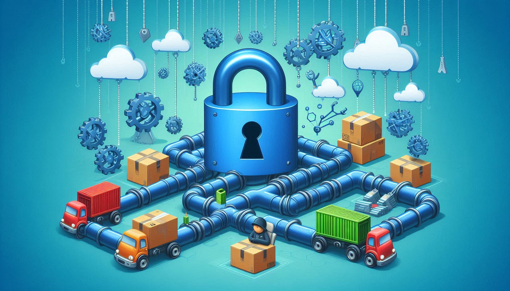

# Why Software Supply Chain Security Matters ?

<!-- import TOCInline from '@theme/TOCInline';

<TOCInline toc={toc} /> -->

## Introduction

  As a security engineer in the R&D team at a cybersecurity company, I've come to realize the growing importance of securing the software supply chain. With open-source and third-party code libraries playing such a crucial role in modern development, it's essential to ensure that every component in the software supply chain is secure. Ignoring this can lead to severe consequences — not just from a technical standpoint, but also in terms of trust and reputation.

  My work involves researching and identifying tools that can help detect vulnerabilities, license issues, and malicious threats within the software supply chain. I’m also developing an event-driven platform that automates the use of multi-layered security scanning tools to provide comprehensive threat detection. This platform aims to enhance decision-making throughout the software development lifecycle, making it easier to spot and address risks before they become serious problems.

  In this article, I’ll discuss why securing the software supply chain is so critical. I’ll dive into the risks associated with insecure open-source libraries and code dependencies, including vulnerabilities, malware, hardcoded secrets, and more.

## What is a Software Supply Chain?

In the context of software, the supply chain refers to all the components, tools, services, and libraries used to develop, build, and maintain an application. This includes:

- **Open-source libraries and frameworks (e.g., React, lodash)**
- **Third-party APIs or services integrated into the software**
- **Build tools (e.g., compilers, CI/CD tools)**
- **Code dependencies (both internal and external)**
- **Software vendors providing solutions that are embedded or rely on the software**

## What is Software Supply Chain Security?

Software supply chain security focuses on ensuring the integrity and safety of all the elements within the software development process, from the coding phase to deployment. Given that many software applications rely heavily on open-source libraries, third-party APIs, and external services, any vulnerability in these components can be a potential point of attack.

### Key Aspects of Software Supply Chain Security:

1. **Managing Dependencies**:  
   Ensuring that external libraries and components are secure, up-to-date, and trusted. Vulnerabilities in these dependencies can lead to breaches if not properly maintained.

2. **Securing Build Pipelines**:  
   The CI/CD (Continuous Integration/Continuous Deployment) pipeline, which automates the process of testing, building, and deploying software, must be protected from attacks that could inject malicious code or alter the build process.

3. **Verifying Third-Party Code**:  
   Ensuring that any code or services provided by third-party vendors or integrated APIs are safe, trusted, and free of malware or security flaws.

4. **Tracking Vulnerabilities**:  
   Monitoring and addressing vulnerabilities in both internal and external components of the software. This includes identifying and patching flaws as they emerge in any part of the supply chain.

5. **License Compliance**:  
   Ensuring that all components are used in compliance with licensing terms, which can prevent legal risks and issues with proprietary code.

### Why It Matters

In today’s interconnected software ecosystem, a breach in one part of the software supply chain — whether it’s a third-party library or an external API — can have cascading effects across the entire software product, compromising the security and functionality of applications. 

Supply chain attacks, like the **SolarWinds hack**, demonstrate the risks of malicious code being inserted into software dependencies, which can go undetected for long periods. 

Thus, securing the software supply chain is critical to prevent such attacks and protect sensitive data, user privacy, and overall system integrity.

### Common Methods of Software Supply Chain Attacks

Understanding common software supply chain attack methods and multi-layered scanning is crucial for addressing various threats. Here are some of the key techniques:

1. **Dependency Confusion**  
   Also known as the "Supply Chain Substitution Attack," this method deploys malicious code by replacing legitimate application dependencies with compromised versions. Attackers may upload a copy of a legitimate library, but with additional malicious code, to deceive developers.

2. **Typosquatting**  
   Typosquatting takes advantage of users' mistakes. For example, attackers may publish a package with a name similar to a well-known package (e.g., 'Mongooes' instead of 'Mongoose') that contains malicious code. This exploits user inattention and can compromise systems.

3. **Compromised Updates**  
   This attack involves hijacking or tampering with legitimate software updates to distribute malware. Attackers exploit the trust placed in update mechanisms to inject malicious code into software.

4. **Revival Hijack (PyPi Attack — 2024)**  
   Revival hijacking is a technique in which attackers manipulate the option to re-register a package after it’s been removed from PyPI’s index by its original owner. The attacker can then publish malicious packages under the same name, but with a higher version, to infect developer environments.

### How to Secure the Software Supply Chain

Securing the software supply chain involves implementing several key strategies and best practices to reduce the risks associated with dependencies, third-party code, build processes, and more. Here are some essential steps to secure the software supply chain:

1. **Manage Dependencies Carefully**
   - **Use Trusted Sources**: Always source dependencies from reputable and trusted package managers or repositories (e.g., npm, Maven, PyPI).
   - **Regularly Update Dependencies**: Keep dependencies up-to-date to patch known vulnerabilities and minimize security risks.
   - **Audit Dependencies**: Continuously audit and scan dependencies for vulnerabilities using tools like Snyk, Dependabot, or OWASP Dependency-Check.

2. **Verify Third-Party Code**
   - **Code Reviews**: Ensure that third-party code or libraries are reviewed for security flaws before integrating them into your system.
   - **Limit External Dependencies**: Minimize reliance on third-party libraries or APIs, especially those that have not been actively maintained or widely used.
   - **Use Signed Packages**: Prefer packages that are cryptographically signed to ensure their integrity.

3. **Secure the Build Pipeline**
   - **Use Secure CI/CD Pipelines**: Protect your Continuous Integration and Continuous Deployment (CI/CD) pipeline from attacks by enforcing strict access controls and validating all code before deployment.
   - **Verify Build Integrity**: Implement tools to verify the integrity of your build process to prevent malicious code injection during compilation.
   - **Implement Multi-Factor Authentication (MFA)**: Enforce MFA for all personnel involved in the build and deployment process to prevent unauthorized access.

4. **Track Vulnerabilities**
   - **Regular Vulnerability Scanning**: Continuously scan both internal and external software components for vulnerabilities using automated scanning tools.
   - **Security Patch Management**: Implement a process for timely application of security patches to address discovered vulnerabilities.

5. **Ensure License Compliance**
   - **Understand License Terms**: Before using third-party components, thoroughly understand the licensing terms to avoid potential legal issues.
   - **Use License Management Tools**: Leverage tools to help track and manage open-source licenses, ensuring compliance with all terms and conditions.

6. **Monitor for Malicious Activity**
   - **Continuous Monitoring**: Implement real-time monitoring and logging to detect any unusual activity or signs of compromise in your supply chain.
   - **Behavioral Analytics**: Utilize behavioral analytics to identify anomalous patterns that could indicate supply chain attacks.

7. **Implement Strong Authentication and Authorization**
   - **Access Control**: Use strong authentication and role-based access control (RBAC) to limit who can access the source code, dependencies, and deployment systems.
   - **Zero Trust Model**: Apply the principle of least privilege and ensure that no one, including internal personnel, can access more than what they need.

8. **Use Secure Communication Channels**
   - **TLS/SSL Encryption**: Ensure that all communications between systems (including dependencies, APIs, and services) are encrypted using TLS/SSL to prevent interception and tampering.
   - **Verify Digital Signatures**: Use digital signatures to verify the authenticity of code and software packages.

9. **Educate and Train Teams**
   - **Security Training**: Educate developers, security teams, and operations personnel on the latest supply chain threats and how to mitigate them.
   - **Phishing Awareness**: Train staff to recognize phishing attacks that may lead to supply chain breaches, such as by tricking users into downloading malicious dependencies.

10. **Implement Incident Response Plans**
    - **Supply Chain Incident Response**: Develop and test incident response plans that specifically address supply chain attacks. Ensure that you can quickly identify, contain, and recover from attacks targeting the supply chain.

By following these best practices, you can significantly reduce the risk of software supply chain attacks and ensure the integrity of your software development process.

### What are the Common Method Attacks in the Software Supply Chain?

- **Dependency Confusion**
- **Typosquatting**
- **Compromised Updates**
- **Revival Hijack (PyPi attack — 2024)**

## Approach to defending  software supply chain:

1. **Verify Dependency Integrity**: Regularly validate the integrity of all dependencies. Use checksums and digital signatures to ensure each dependency hasn't been tampered with.

2. **Leverage SCA Tools (like Snyk)**: Use Software Composition Analysis (SCA) tools such as Snyk to identify vulnerabilities in your dependencies. Automate scans in your CI/CD pipeline to catch issues early.

3. **Track Dependency Changes**: Maintain an SBOM (Software Bill of Materials) to keep track of all dependencies. Use tools like Dependency Track to continuously monitor these components for new vulnerabilities.

4. **Apply Updates Promptly**: Regularly update dependencies to mitigate risks from known vulnerabilities. Set up automated notifications to ensure your components are always up-to-date.

