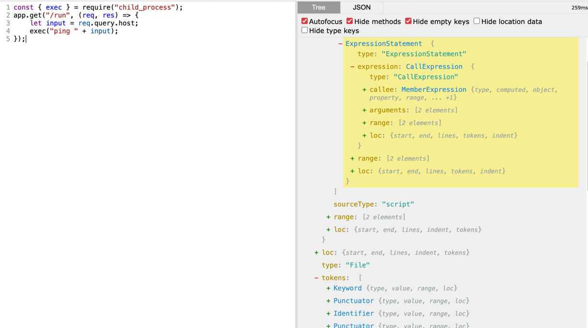
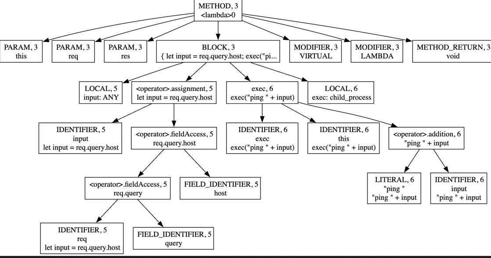
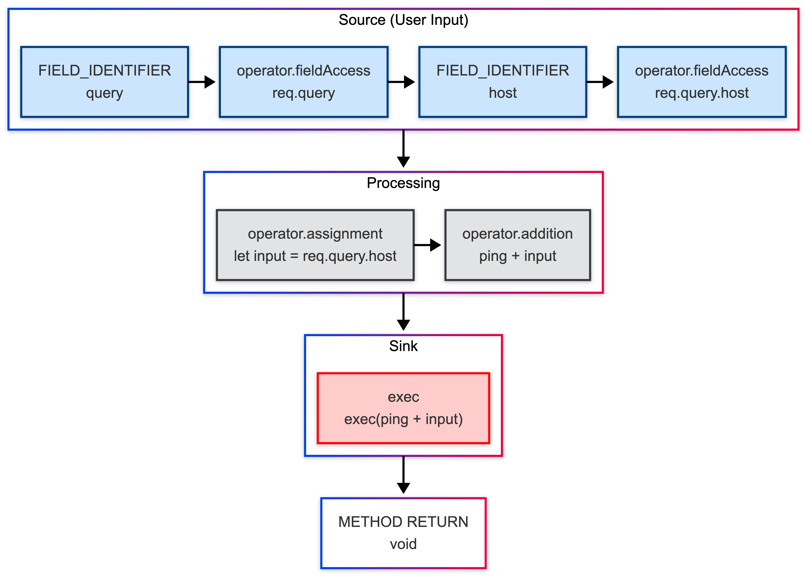
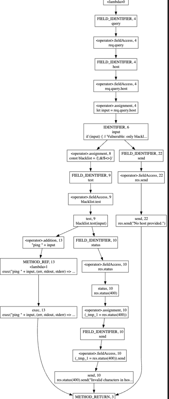
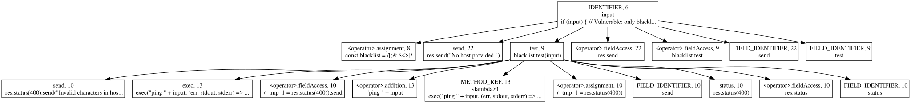
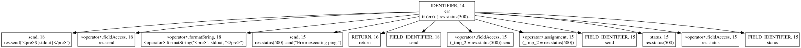
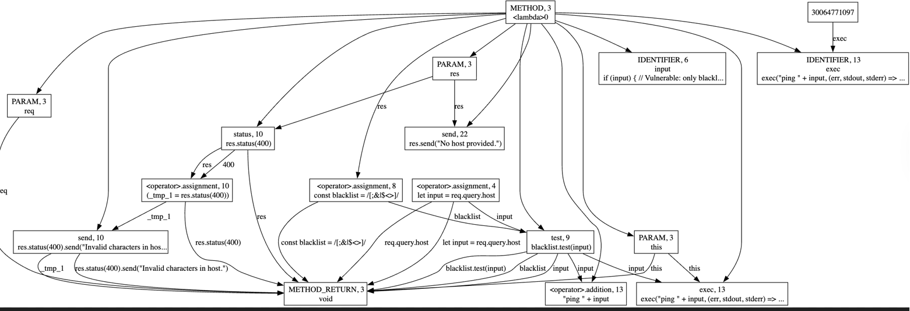
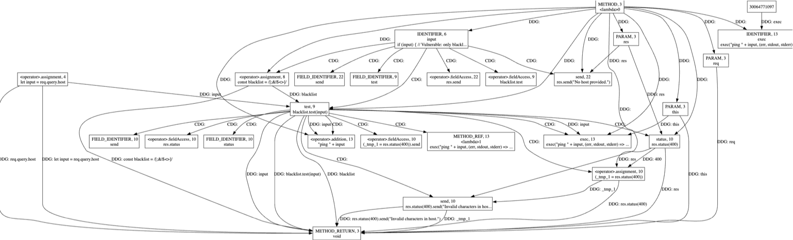
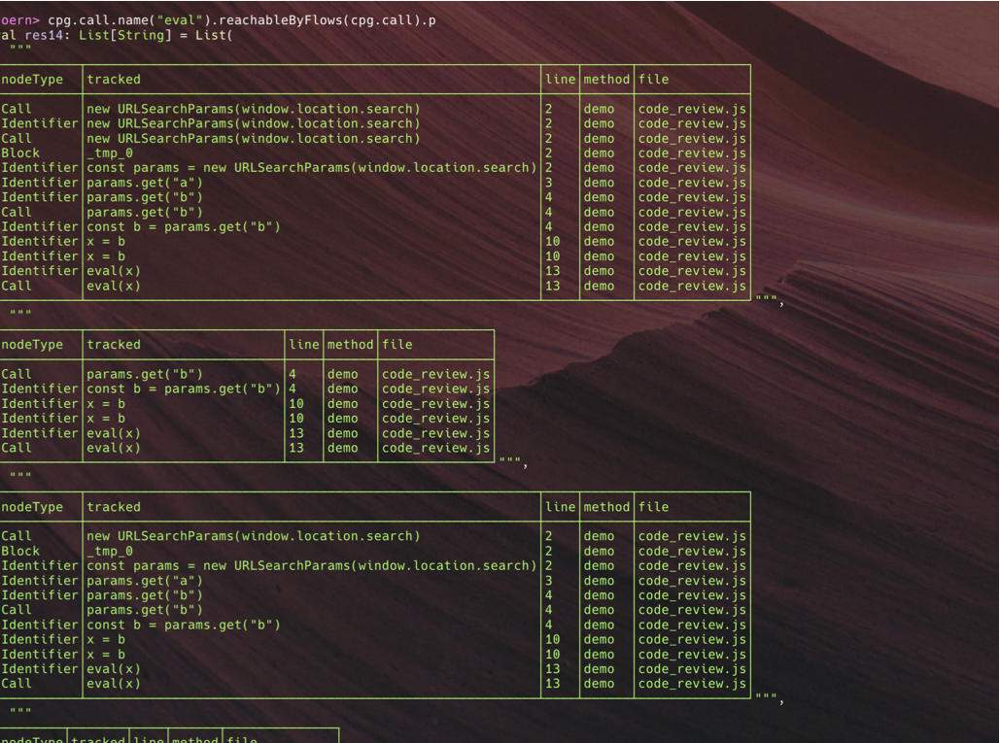

# Core Pillars of SAST

## The Core Pillars of Static Application Security Testing (SAST)

:::tip How to read this page

If you're new: skim the table first, then jump to **DDG** (data flow) and **CFG/CDG** (reachability). Those are the two pieces that turn "looks risky" into "actually exploitable."

:::

Static Application Security Testing (SAST) is not limited to AST-based pattern matching. While the Abstract Syntax Tree (AST) captures the syntactic structure of code, effective vulnerability analysis also requires modeling control flow (CFG), control dependencies (CDG), and data dependencies (DDG/PDG) to determine whether potentially risky code is actually reachable and exploitable.

Two major challenges in real-world codebases are:

- **Reachability**: Can potentially dangerous code actually execute at runtime?
- **False positives**: Does code appear risky syntactically but remain safe in practice?

Modern SAST tools address these challenges by combining multiple graph models, providing both execution context and data provenance, which are essential for precise vulnerability detection.

> In secure code review, context is everything: **what runs**, **why it runs**, and **where the data comes from**.

:::info Why this matters

If you only use syntax matching, you miss exploitability context.  
Graph-based analysis adds execution and data-flow reasoning, which significantly improves signal quality.

:::

| Graph | Main question it answers | Quick intuition |
| ----- | ------------------------ | --------------- |
| AST | How is code structured? | Syntax tree / outline |
| CFG | What can execute next? | Flowchart of paths |
| CDG | Which condition controls this statement? | Why this line executes |
| DDG | Where did this value come from? | Data provenance chain |
| PDG | What control + data dependencies exist together? | CDG + DDG in one graph |
| CPG | How do these layers connect in one model? | Unified security graph |

In short: **AST is the foundation**, CFG builds execution paths on top of it, and CDG/DDG/PDG refine reasoning about exploitability. CPG ties these layers together for practical security queries.

:::note Quick memory rule

`AST = structure`, `CFG = execution paths`, `CDG = control conditions`, `DDG = data flow`, `PDG = control + data`, `CPG = unified model`.

:::

## What Is an Abstract Syntax Tree (AST)?

An Abstract Syntax Tree (AST) is a structured representation of source code.  
It keeps the syntactic meaning of code (not formatting), so tools can analyze it reliably.

```javascript
const { exec } = require("child_process");
app.get("/run", (req, res) => {
  let input = req.query.host;
  exec("ping " + input);
});
```



Example AST-style output:

```
Program
  VariableDeclaration (const)
    Variable: undefined
      FunctionCall: require
        Literal: child_process
  FunctionCall: app.get
    Literal: /run
    ArrowFunction
    Params:
      req
      res
        VariableDeclaration (let)
          Variable: input
            MemberAccess: req.query.host
        FunctionCall: exec
          BinaryExpression (+)
            Literal: ping
            Identifier: input
```



### How AST Is Used

- **Compilers**: lower source code into intermediate representations and machine code.
- **Linters / quality tools**: detect style issues, dead code, and suspicious patterns.
- **SAST tools**: detect insecure API usage and known vulnerability patterns.

## Control Flow Graphs (CFG)

A Control Flow Graph (CFG) models all possible execution paths of a program.

- **Node**: a basic block (one or more statements with no internal jump)
- **Edge**: a possible transition from one block to another
- **Why it matters**: it shows runtime path possibilities, not just syntax

```javascript
const { exec } = require("child_process");
app.get("/run", (req, res) => {
  let input = req.query.host;
  exec("ping " + input);
});
```



### How Is a CFG Created?

A CFG is built by traversing the AST and connecting blocks using execution rules:

- sequence flow (statement A -> statement B)
- branch flow (`if/else`, `switch`)
- loop back-edges (`for`, `while`)
- call/return behavior across function boundaries

So:

- `AST` = code structure
- `CFG` = executable paths extracted from structure

With CFG, security tools can ask:

- Can user-controlled input reach a dangerous sink such as `exec`?
- Which branches/loops allow that path?
- Is there a realistic exploit path (for example, command injection leading to RCE)?

### Example

:::caution Beginner note

Blacklists are easy to bypass (different shells/OS parsing, escaping, encoding, whitespace, and missing metacharacters). Prefer _avoiding the shell_ (e.g., `execFile`/`spawn` with an argument array) and validating input with an allowlist.

:::

```javascript
const { exec } = require("child_process");

app.get("/run", (req, res) => {
  const input = req.query.host;

  if (input) {
    // Vulnerable: blacklist-based filtering is incomplete
    const blacklist = /[;&|$<>]/;
    if (blacklist.test(input)) {
      res.status(400).send("Invalid characters in host.");
    } else {
      exec("ping " + input, (err, stdout) => {
        if (err) {
          res.status(500).send("Error executing ping.");
          return;
        }
        res.send(`<pre>${stdout}</pre>`);
      });
    }
  } else {
    res.send("No host provided.");
  }
});
```



## Control Dependence Graphs (CDG)

A Control Dependence Graph (CDG) explains how program execution is controlled by conditions such as if, else, and loops. It shows which decision points must evaluate in a certain way before a statement can run. In security review, this helps you understand not just what code exists, but when it becomes reachable. So CDG is useful for deciding whether a vulnerable-looking sink can actually execute under attacker-influenced conditions.

CDG answers: **Which condition decides whether this statement runs?**

In a CDG:

- nodes represent statements/blocks
- edges represent control dependencies (`if`, `while`, `for`, etc.)

For the vulnerable handler above:

- the `if (input)` condition controls whether `exec(...)` is even reachable
- the `if (blacklist.test(input))` condition controls whether execution goes to reject path or sink path





## Data Dependence Graphs (DDG)

A Data Dependence Graph (DDG) shows how values move through a program from where they are defined to where they are used. It answers the question: "Where did this value come from?" by connecting assignments, variables, and expressions along data-flow paths. In secure code review, DDG is critical for tracing attacker-controlled input to sensitive sinks such as exec, SQL queries, or file operations. This helps confirm whether suspicious code is truly exploitable or just a false positive.

DDG answers: **Where did this value come from?**

- **Purpose**: Shows how data flows between statements (which statement produces a value that another statement consumes).
- **Data provenance chain**: Helps trace the origin of a variable's value.

It models data flow (definition -> use), for example:

- parameter/variable assignment edges
- propagation across expressions
- sink argument provenance

In our example, DDG helps show whether attacker input can flow into `exec("ping " + input)`.



## Program Dependence Graphs (PDG)

PDG answers: **Why does this run (control), and what data feeds it (data)?**

PDG combines:

- **CDG edges** (control dependence)
- **DDG edges** (data dependence)

This combined view is powerful for slicing and exploitability reasoning.



## Hands-On: Finding Vulnerabilities with Joern (CFG, CDG, DDG, PDG)

If you want SAST to be useful (not only pattern matching), ask:

1. **Can attacker-controlled data reach a vulnerable sink?** (DDG)
2. **Can control flow actually permit that path?** (CFG/CDG)

Joern builds a Code Property Graph (**CPG**) and lets you run dataflow reachability queries from source to sink.

### Vulnerable Code

```javascript
function demo() {
  const params = new URLSearchParams(window.location.search);
  const a = Number(params.get("a"));
  const b = params.get("b");   // user-controlled input

  let x;
  if (a > 0) {
    x = "safe";
  } else {
    x = b;
  }

  eval(x);   // vulnerable sink
}

demo();
```

### Intuition

- `a > 0` controls which assignment to `x` executes (CDG).
- `b` can flow to `eval(x)` through `x = b` (DDG).
- PDG combines both: under `a <= 0`, user input reaches the vulnerable sink.



## Final Takeaway

AST gives structure. CFG adds execution paths. CDG and DDG explain control/data dependencies. PDG combines both. CPG unifies all of them for practical security analysis.

If you are building or evaluating SAST tooling, this layered model is what turns simple pattern matching into meaningful vulnerability detection.

## What's Next

In the next blog, we will explore how AI agents can enhance secure code review.  
From automatically flagging risky patterns to generating targeted queries for detecting complex flows, AI can help make SAST smarter, faster, and more accurate.
